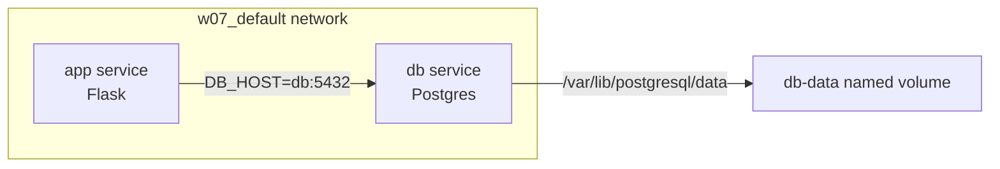

# W07｜Docker Compose 與資料持久化

## 拓樸圖

## 從 docker run 到 compose.yaml

我最有感的改善是 Compose 把原本很多條 `docker run`、`docker network create`、`docker volume create` 都整理成一份 `compose.yaml`。以前用指令一條一條打，很容易漏掉 network、volume 或環境變數；改成 compose 後，只要 `docker compose up -d`，網路、volume、app、db 都會照設定一起建立，比較容易重現，也比較不怕自己漏步驟。Compose 的重點就是用 YAML 描述最終狀態，讓 Docker 幫忙建立服務、網路與 volume。

## 三種掛載對照

| 掛載類型 | 路徑（host） | 容器砍重起資料還在嗎 | 重啟容器資料狀態 | 適合情境 |
|---|---|---|---|---|
| named volume | `/var/lib/docker/volumes/db-data/_data` | 會在，除非刪除 volume | 資料保留 | 資料庫資料、production 資料 |
| bind mount | `./app:/app` | 會在，因為資料在 host 指定資料夾 | host 檔案仍保留，容器重啟後仍看得到 | 開發時掛 source code、即時修改 |
| tmpfs | 記憶體中，不落地到固定 host 路徑 | 不會在，容器停止後消失 | 重啟後資料消失 | 暫存、敏感資料、cache |

## healthcheck 前後對照

| 寫法 | curl /healthz t=1s | t=3s | t=5s | t=10s |
|---|---|---|---|---|
| 只 depends_on | 失敗 / connection refused | 可能失敗 | 可能成功 | 成功 |
| service_healthy | 等待 db healthy，app 尚未完全就緒 | 可能成功 | 成功 | 成功 |

### 觀察（自己的話）

只用 `depends_on` 時，只能保證 db 容器有啟動，不能保證 Postgres 已經真的可以接受連線，所以 app 可能太早啟動，導致一開始 `/healthz` 失敗。加上 healthcheck 和 `condition: service_healthy` 後，Compose 會等 db 健康後才啟動 app，因此 app 比較不會因為 db 還沒準備好而連線失敗。

## 排錯紀錄

- 症狀：
  app 啟動後，`curl /healthz` 一開始可能出現 connection refused 或資料庫連線失敗。

- 診斷：
  使用 `docker compose ps` 檢查服務狀態，再用 `docker compose logs app` 和 `docker compose logs db` 觀察 app 是否比 db 更早開始連線。若 db 尚未 ready，但 app 已經嘗試連線，就代表只有 `depends_on` 不夠。

- 修正：
  在 db service 加上 `healthcheck`，並在 app service 的 `depends_on` 中改用 `condition: service_healthy`，讓 app 等 db 健康後再啟動。

- 驗證：
  重新執行 `docker compose down` 與 `docker compose up -d`，再用 `curl http://localhost:8080/healthz` 測試，確認 app 可以穩定回應健康狀態。

## 設計決策

db 使用 named volume，而不是 bind mount，是因為資料庫資料應該交給 Docker 管理，避免直接手動修改資料庫檔案造成資料毀損。named volume 也比較適合 production，因為容器刪掉後資料仍會保留，除非明確刪除 volume。

tmpfs 不適合在生產環境存資料庫，因為 tmpfs 是存在記憶體中的暫存資料，容器停止或主機重啟後資料就會消失。它比較適合放 cache、臨時檔或敏感暫存資料，不適合放需要長期保存的資料庫內容。
