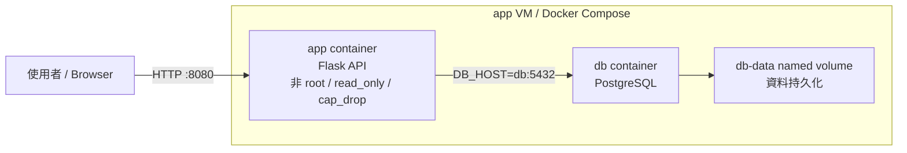

# 期末實作 — 411630121 曾若嬅

## 1. 架構總覽

本次期末實作使用 Docker Compose 部署一個 Flask app 與 PostgreSQL db。使用者透過 host 的 `8080` port 存取 app，app 再透過 Compose 內部 network 使用 service name `db` 連到 PostgreSQL。

資料庫資料存放在 named volume `db-data`，因此即使 container 被刪除，只要 volume 沒有被刪除，資料仍然可以保留。

整體架構也加入 healthcheck、log rotation、資源限制與最小權限設定，讓容器不只是能正常運行，也更接近 production-ready 的部署方式。透過 healthcheck 可以持續監控服務狀態，利用 named volume 達成資料持久化，並透過 cgroup 限制記憶體、CPU 與 process 數量，避免單一容器影響整台主機。

此外，app 容器採用非 root 身分執行，並搭配 read-only filesystem、cap_drop 與 no-new-privileges 等安全設定，降低容器遭入侵後的風險，符合最小權限（Least Privilege）原則。

## 2. Part A：底座與基準點
<ssh 證據 + 版本 + snapshot>

## 3. Part B：Dockerfile 與快取
<Dockerfile + 兩次 build 對照>

### 為什麼聽 8080 不聽 80？
因為這個 image 會用非 root 使用者執行。Linux 中 80 屬於 1024 以下的 privileged port，非 root 預設不能直接綁定。為了符合最小權限原則，又避免額外加 `CAP_NET_BIND_SERVICE`，所以 app 改聽 8080。這樣容器可以用非 root 執行，安全性比較好。

## 4. Part C：Compose 與資料持久化
<compose.yaml 重點 + 三段對照>

### down vs down -v

`docker compose down` 會刪除 container 和 network，但不會刪除 named volume，所以資料庫資料仍然保留。

`docker compose down -v` 則會連同 named volume 一起刪除，因此 PostgreSQL 的資料目錄也會被刪掉，原本寫入的資料就會消失。

named volume 的生命週期不跟 container 綁在一起，而是由 Docker volume 管理，除非手動刪除 volume，否則 container 重建後資料仍會保留。

## 5. Part D：生產化加固
<權限驗證輸出 + cgroup 讀值對照表>

### yaml 的值怎麼對回 cgroup 檔案？
`mem_limit: 256m` 會對應到 cgroup v2 的 `memory.max`，讀到的值是 `268435456`，也就是 256 MiB。

`cpus: "0.5"` 會對應到 `cpu.max`，讀到 `50000 100000`，代表每 100000 微秒的週期中，只能使用 50000 微秒，也就是 0.5 顆 CPU。

`pids_limit: 200` 會對應到 `pids.max`，代表這個容器最多只能建立 200 個 process。

## 6. Part E：故障演練
### 故障 1：F1 停 db

- 注入方式：  `docker compose stop db`

- 故障前：  `docker compose ps` 顯示 app 與 db 都是 Up/healthy，`curl /healthz` 回傳 200 ok。

- 故障中： 停止 db 後，app 容器仍然 Up，但 `/healthz` 回傳 HTTP 503，log 顯示 `db unreachable`。約 30 秒後 healthcheck 將 app 標成 unhealthy。

- 回復後：  `docker compose start db` 後，db 恢復 healthy，app 的 `/healthz` 再次回傳 200 ok。

- 診斷推論： HTTP 503 代表網路層和容器層都還通，app 也還有回應，只是 app 依賴的 db 服務不可用。因此問題在應用相依層，不是 app 容器死亡，也不是 port 沒開。

### 故障 2：F2 停止 app

- 注入方式：
  `docker compose stop app`

- 故障前：
  app 與 db 都是 Up/healthy，`curl /healthz` 回傳 200 ok。

- 故障中：
  停止 app 後，`curl http://localhost:8080/healthz` 顯示 connection refused，表示 host 上 8080 port 沒有服務在接受連線。

- 回復後：
  `docker compose start app` 後，app 恢復 Up/healthy，`curl /healthz` 回傳 200 ok。

- 診斷推論：
  connection refused 代表網路封包有到達目標主機，但該 port 沒有程式在監聽。這和 HTTP 503 不同，503 是 app 有回應但內部依賴失敗；connection refused 則是容器或服務本身沒有在該 port 提供服務。

### 三症狀分層表

| 症狀 | 最可能的層 | 第一條驗證命令 |
| ---- | ---------- | -------------- |
| timeout | 網路層 / 防火牆 / 路由 | `ping <ip>` 或 `ss -tlnp` |
| connection refused | 容器層 / process 沒監聽 port | `docker compose ps` |
| HTTP 503 | 應用層 / 相依服務失敗 | `docker compose logs app` |

## 7. 反思（200 字）

這學期從 VM 做到 production-ready 容器後，我對「隔離」的理解變得比較清楚。以前只覺得隔離就是把東西分開，但實際做完才發現，不同層的隔離其實防的東西不一樣。

VM 的隔離比較像是把整台機器分開，每台 VM 有自己的系統環境，主要是防止不同主機互相影響。Namespace 則是讓 container 看到不同的 process、network、mount 視角，讓它以為自己在獨立環境中。Cgroup 不是隔離視角，而是限制資源，例如記憶體、CPU、process 數，避免某個 container 把整台 host 拖垮。權限階梯則是從安全角度限制 container，即使攻擊者進到容器內，也不能用 root、不能亂寫檔案、不能使用多餘 capability。

所以這些隔離不是同一件事，而是從不同角度降低風險。真正 production-ready 的容器，不只是能跑，還要能被限制、被觀察、出問題時不影響整台主機。

## 8. Bonus（選做）
